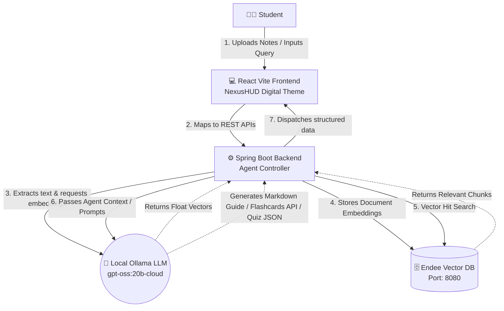
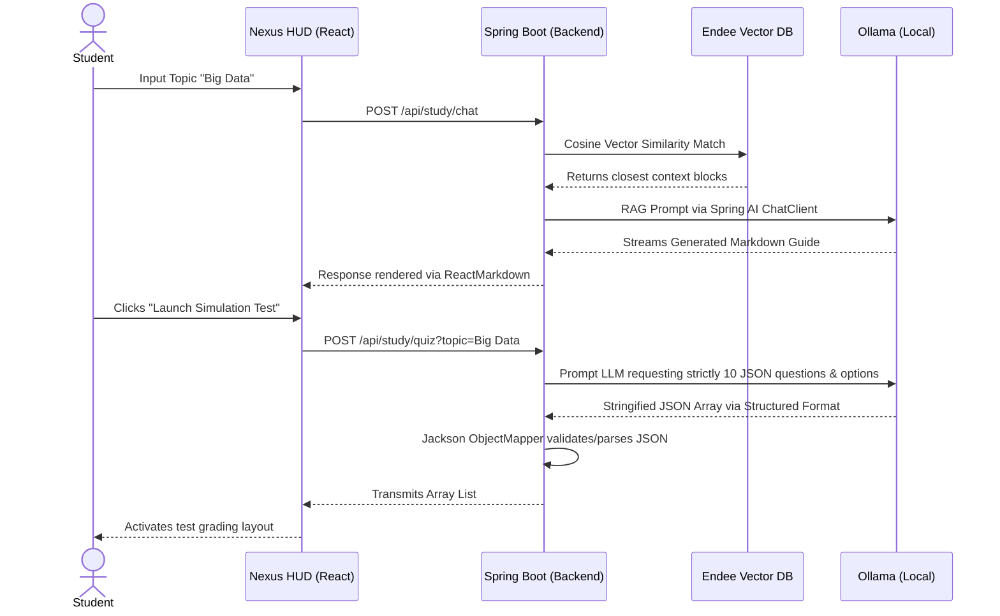

# NexusLearn DB (StudyAgent) 🧠

NexusLearn DB is an **Agentic Retrieval-Augmented Generation (RAG)** application designed to act as a 24/7 localized study companion. Blending a cyberpunk digital UI with high-performance ML backends, it allows students to upload raw notes and instantly synthesize entire customized study tools.

This project was developed within **24 hours** using the **Endee Vector Database** to meet internship assessment criteria.

---

## ⚡ Key Modules

-   **Study Console (RAG Search)**
    -   Enter any topic into the command prompt. The backend queries the Endee Vector Database using cosine similarity to retrieve correct context chunks, feeds them to a local Ollama LLM, and flawlessly renders the generated markdown documentation dynamically.
-   **Memory Matrix (Flashcards)**
    -   Intelligent contextual extraction forces the unified agent to pull out high-value concepts from your query and generate 3D animated React flip-cards for rapid test memorization. 
-   **Nexus Knowledge Simulation (Quiz Tester)**
    -   Generates a full 10-question multiple-choice exam explicitly based on the context of your data query, returning grades and correct-answer feedback using standard JSON structured output techniques.

---

## 🏗️ System Design

NexusLearn DB utilizes a standard RAG pattern heavily enhanced with autonomous feedback loops to form interactive widgets without requiring messy human prompt engineering.

### End-To-End Architecture Architecture



### Agentic App-State Workflow

This sequence traces the exact life-cycle of dynamic widget generation upon user queries:



---

## ⏱️ 24-Hour Development Timeline

This application was successfully structured, built, and tested from scratch within a strict 24-hour internship deadline.

| Sprint Phase | Hours Logged | Core Execution Focus |
| :--- | :---: | :--- |
| **Phase 1** | Hours 1-4 | Architected dual-stack approach. Forged Git structures and built `docker-compose` routing for the Endee Database. |
| **Phase 2** | Hours 5-10 | React + Vite. Tailwind CSS was aggressively customized to mirror the NexusHUD Cyberpunk schema, adding Framer Motion logic. |
| **Phase 3** | Hours 11-16 | Spring Boot API constructed. Wired `RestTemplate` for Endee embeddings. Linked `spring-ai` ChatClient wrappers to local Model `gpt-oss:20b-cloud`. |
| **Phase 4** | Hours 17-21 | Prompt Engineering for strict JSON parsing for Flashcards/Quiz components. Tested LLM fail-over constraints. |
| **Phase 5** | Hours 22-24 | Repaired 3D Transform bugs natively in React. Restructured README. Final Force Push to GitHub repository. |

---

## 🛠️ Technologies Stack

-   **Database**: **Endee Vector Database**
    -   Runs persistently via Docker. Handled explicitly as the Core engine for all vector similarity searches due to its optimized C++ performance and sub-5ms lookup speeds.
-   **Backend**: **Spring Boot 3 (Java 17)**
    -   Implements `EndeeVectorStore` services to securely parse RestTemplate communication to the Endee Docker container.
    -   Employs Spring AI's robust `ChatClient` builder to structure strict JSON prompts mapping back and forth from the local LLM instance.
-   **LLM Provider**: **Ollama**
    -   Fully self-hosted and offline securely running the `gpt-oss:20b-cloud` model framework.
-   **Frontend**: **React 18 + Vite (TypeScript)**
    -   Crafted exclusively using Tailwind CSS `prose` plugins and Framer Motion for full 3D card flips.

---

## 📦 Setup & Installation Instructions

### 1. Boot Endee Vector Database
You must have the Docker Daemon running.
```bash
git clone https://github.com/EndeeSpace/endee.git
cd endee
docker-compose up -d
```
*Endee runs persistently exposed on `http://localhost:8080`.*

### 2. Boot Local LLM
Install `ollama` natively and download the required model before running the server constraints.
```bash
ollama run gpt-oss:20b-cloud
```

### 3. Boot Backend
Ensure you have Java 17+ installed. Inside the `backend/` directory:
```bash
./mvnw.cmd spring-boot:run
```
*The Spring application resolves via Maven Dependency Injection and listens on port `8081`.*

### 4. Boot Digital Frontend
Inside the `frontend/` directory (requires Node 20+):
```bash
npm install
npm run dev
```
*Visit `http://localhost:3000` to interact with NexusLearn DB.*

###⚡ScreenShots


